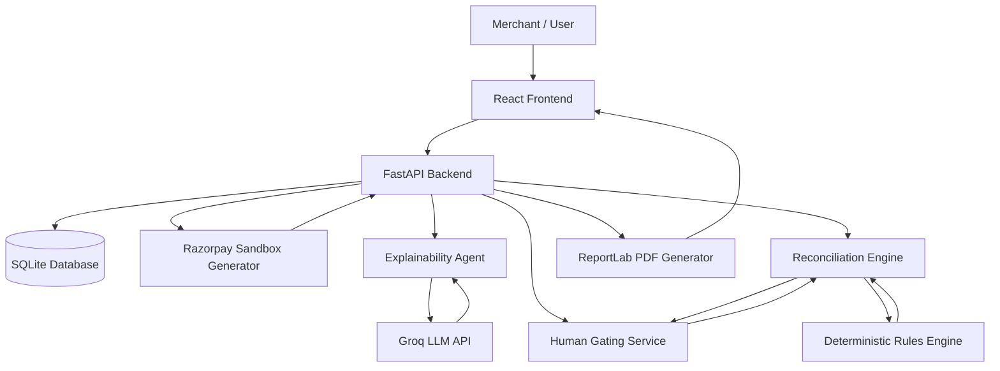
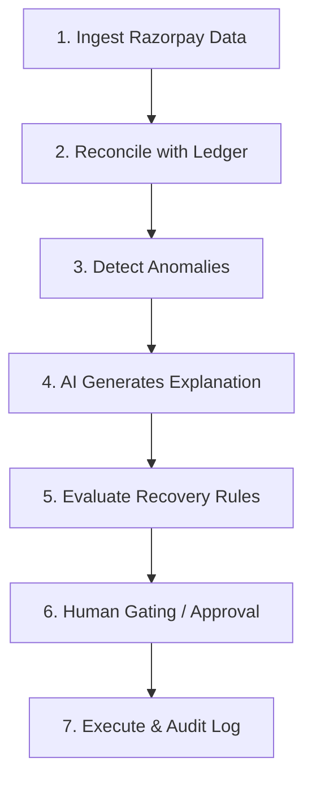
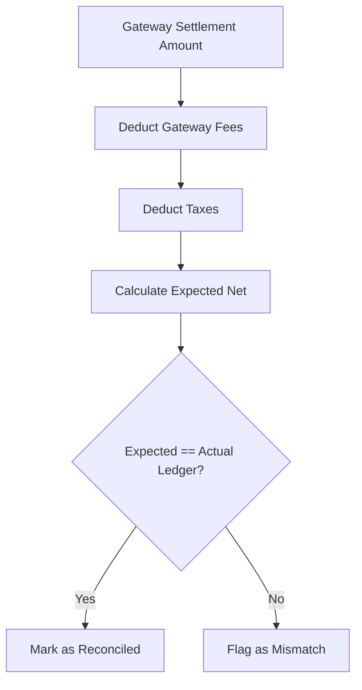
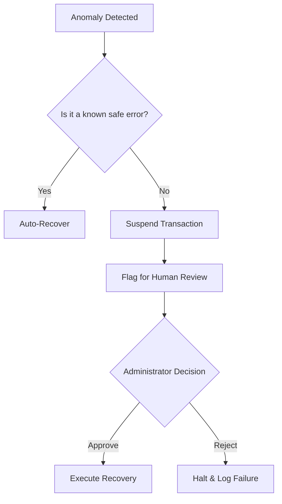

# AI Settlement Auditor: Autonomous Razorpay Reconciliation
```
> A full-stack autonomous settlement auditing and reconciliation platform designed to detect mismatches, explain financial failures in plain English, recover funds within policy bounds, and ensure absolute deterministic decision safety for Razorpay merchants.
```
## Table of Contents
```
- [Overview](#overview)
- [Problem Statement](#problem-statement)
- [Our Solution](#our-solution)
- [Key Features](#key-features)
- [System Architecture](#system-architecture)
- [How the Platform Works](#how-the-platform-works)
- [Reconciliation Logic](#reconciliation-logic)
- [Safety and Human Gating](#safety-and-human-gating)
- [AI and Explainability](#ai-and-explainability)
- [Tech Stack](#tech-stack)
- [Getting Started](#getting-started)
```
## Overview
```
**AI Settlement Auditor** is a fintech application built around a simple principle:
```
> **Complete settlement transparency and automated, safe recovery.**
```
The platform brings together ledger reconciliation, automated recovery, and artificial intelligence in a single dashboard. 
```
Merchants can:
```
- Ingest live settlement data and compare it against their internal ledgers.
- View real-time transaction performance and mismatch rates.
- Understand exactly why a transaction or refund failed through plain English AI explanations.
- Automatically execute bounded recovery actions for known failure patterns.
- Review and approve high-risk anomalies that require human oversight.
- Generate automated executive PDF reports summarizing financial health and recovered funds.
```
The goal is not to replace human financial controllers. Instead, the platform is designed as an autonomous agent that handles the repetitive tasks of reconciliation, while escalating complex edge cases to humans with full context.
```
## Problem Statement
```
Many merchants and financial controllers find payment reconciliation difficult because data is spread across different dashboards and technical logs.
```
Common challenges include:
```
- Difficulty understanding complex gateway error codes and webhook failures.
- Manual effort required to match expected ledger amounts with actual settled amounts.
- Lack of clarity around hidden bank fees or delayed tax deductions.
- Slow recovery times for stuck refunds or captured but unsettled payments.
- Support tickets losing context when transferred between agents.
- High risk of automated systems making irreversible financial mistakes.
```
AI Settlement Auditor addresses these challenges by combining **deterministic rule engines, automated recovery logic, AI driven explainability, and strict human safety gating** in one platform.
```
## Our Solution
```
AI Settlement Auditor provides a unified workflow:
```
**Ingestion > Reconciliation > Detection > AI Analysis > Rule Evaluation > Human Gating > Audit Log**
```
The system pulls transaction data and immediately reconciles it against expected values. The AI analyzes any anomalies to provide a clear explanation. If the issue is common and low risk, the deterministic rules engine executes a recovery action. If the issue is high risk or ambiguous, it is placed in a gated queue for human review. Every single action is recorded in an immutable audit log.
```
## Key Features
```
### Deterministic Ledger Reconciliation
The platform compares gateway settlements against internal ledger expectations to detect discrepancies in fees, taxes, and net settled amounts.
```
### Plain English Explainability
Complex API errors and failure codes are translated into simple, readable explanations using the Groq LLM. It helps non-technical staff understand exactly where the money is stuck.
```
### Autonomous Recovery Rules
Pre-defined, strict policy bounds allow the system to automatically trigger recovery actions for known, safe issues (e.g., retrying a webhook, initiating a gateway refund sync).
```
### Human Safety Gating
Any anomaly that falls outside of the approved automated policy bounds is flagged and paused. A human administrator must review the AI generated context and explicitly approve or reject the action.
```
### Executive Reporting
The system generates automated PDF reports detailing the total transactions audited, mismatches detected, amounts successfully recovered, and the current compliance posture of the system.
```
## System Architecture
```
AI Settlement Auditor follows a modular full-stack architecture separating the presentation layer, the reconciliation engine, the deterministic rules engine, the AI explainability service, and the database.
```

`
## How the Platform Works
```
The core of the system operates on a strict 7 step pipeline to ensure financial safety and accurate tracking over time.
```

`
## Reconciliation Logic
```
The business logic of the application centers around verifying that the money received matches the money expected, factoring in all gateway deductions.
```

`
## Safety and Human Gating
```
To guarantee absolute financial safety, the system prevents autonomous modules from executing high risk actions without human approval.
```

`
## AI and Explainability
```
The platform includes an AI assistant powered by **Groq**. 
```
Crucially, **the AI never makes financial decisions**. The core architectural rule is: Rules decide, AI explains. The LLM is strictly utilized to retrieve transaction context and translate raw API failure codes into human readable formats. All money moving decisions remain locked within the deterministic rules engine or the human gating service.
```
## Tech Stack
```
- **Frontend:** React, TypeScript, Vite, Tailwind CSS, Lucide Icons
- **Backend:** Python, FastAPI, Uvicorn
- **Database:** SQLite, Pandas
- **AI Integration:** Groq API (compound-mini model)
- **Document Generation:** ReportLab
```
## Getting Started
```
1. Clone the repository.
2. Install Python dependencies: pip install -r requirements.txt
3. Set your Groq API key in the .env file: GROQ_API_KEY=your_key_here
4. Start the backend: python main.py
5. Navigate to the frontend directory: cd frontend
6. Install Node dependencies: npm install
7. Start the frontend: npm run dev
